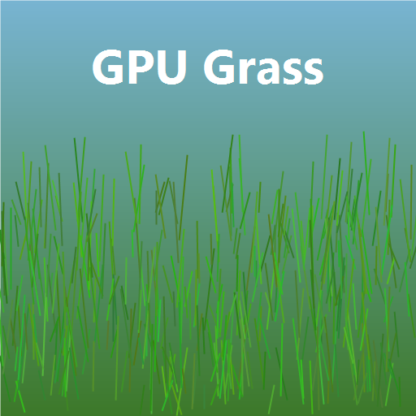

# Stride GPU Grass System

A GPU-driven grass renderer for [Stride](https://www.stride3d.net/). One compute
dispatch turns a list of seed points into hundreds of thousands of animated,
LOD-culled grass blades — with procedural shading (no textures), world-space
wind, and a scrolling *trample field* that flattens a trail under the player.

It is **fully decoupled from any terrain**: you decide where the grass grows by
handing it seeds. Scatter them over a flat area, sample a heightmap, raycast onto
colliders, or read a voxel surface — the renderer doesn't care.



## What's in the box

| File | Role |
|------|------|
| `GrassRenderer` | The engine. Owns the GPU buffers, the two compute passes, the material and its own `Entity`. Feed it seeds, call `Update` once per frame. |
| `GrassField` | Drop-in `SyncScript`. Attach it to an entity, tweak the knobs in Game Studio, press play. |
| `GrassScatter` | CPU helpers that turn a surface into `GrassSeed[]` (flat area or via a height sampler). |
| `GrassSeed` | The 16-byte struct the renderer consumes: a root position + a variation hash. |
| `Effects/*.sdsl` | `GrassCull` (build + LOD), `GrassTrampleUpdate` (trample field), `GrassDiffuse` (blade color), `GrassWind` (sway). |

## Quick start (drop-in)

1. Reference `StrideGrassSystem` from your game project.
2. Add an empty entity, attach a **GrassField** component (category *Grass*).
3. Set `Camera` to your scene camera, tweak `AreaSize` / `CellSize` / `GrassDistance`.
4. Press play.

## Use it directly (heightmap / voxel / streamed world)

```csharp
_grass = new GrassRenderer(Services, GraphicsDevice, maxInstances: 1_000_000);
_grass.SetGrassDistance(80f);
Entity.Scene.Entities.Add(_grass.GrassEntity);

// Static field: scatter over an area, sampling your ground height.
var seeds = GrassScatter.OverArea(
    center: Vector3.Zero, sizeX: 200, sizeZ: 200, cellSize: 0.5f,
    heightSampler: (x, z) => MyTerrain.TryGetGroundY(x, z, out var y) ? y : (float?)null);
_grass.SetSeeds(seeds);

// …or stream a big world chunk-by-chunk:
_grass.SetChunkSeeds(new Int3(cx, 0, cz), chunkSeeds);   // region entered range
_grass.RemoveChunk(new Int3(cx, 0, cz));                  // region left range

// Each frame:
_grass.ClearTrampleSources();
_grass.AddTrampleSource(playerPos, radius: 1.5f);   // flatten a trail
_grass.Update(cameraPos, (Game)Game);
```

## How it works

- **Seeds, not blades.** The CPU only ever holds one point per grass *cell*. The
  `GrassCull` compute shader expands each seed into up to 32 sub-blades, jittered
  deterministically from the seed's variation hash, and writes their world
  matrices straight into the buffer backing a `InstancingUserBuffer`.
- **Free LOD.** Sub-blades beyond the current distance-based LOD count are written
  as degenerate (zero) matrices, so the rasterizer discards them for nothing — no
  indirect draws, no CPU culling.
- **Trample field.** A small R8 texture scrolls with the camera. Every frame the
  `GrassTrampleUpdate` pass decays it and stamps the active sources; blades sample
  it and bend *away* from the gradient, recovering after a couple of seconds.
- **No textures.** Blade color, midrib, edge shading and the pointed alpha shape
  are all procedural in `GrassDiffuse`, so the asset ships without any image
  dependencies. `SetColorScale` dims it for day/night.

## Demo

Open `StrideGrassSystem.sln`, set **Demo.Windows** as the startup project and run.
Fly around with WASD + right-mouse. The camera leaves a flattened trail through
the field.

## License

MIT. See [LICENSE.md](LICENSE.md).
